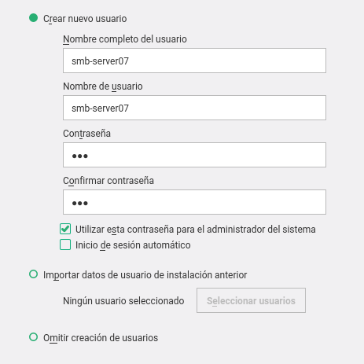

# SAMBA

Para esta práctica vamos a utilizar tres máquinas virtuales que van a 
ser:

* Una de OpenSuse que funcionará como servidor.
* Una de OpenSuse que funcionará como cliente.
* Una de Windows que funcionará como cliente.

## 1. Servidor Samba 

#### 1.1 Preparativos

Configuramos el equipo cambiándole el nombre del equipo.

